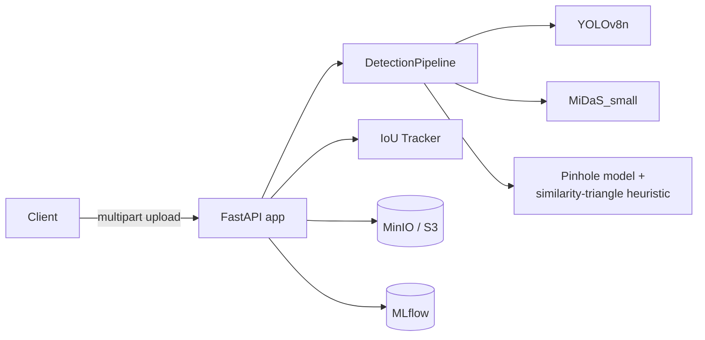
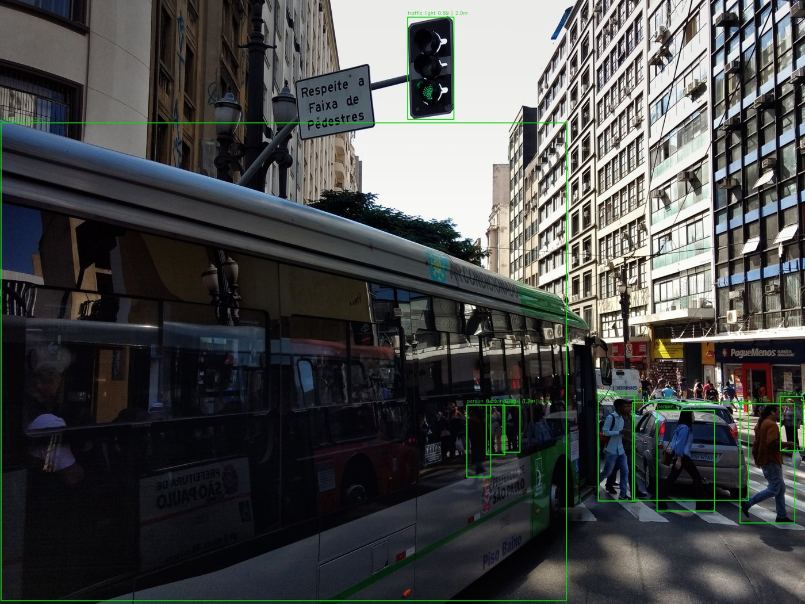

# 3D Object Detection System

A self-hosted computer-vision inference service that combines a pretrained
**YOLOv8n** detector, a pretrained **MiDaS_small** monocular depth model,
an IoU-based multi-object tracker, and a pinhole-camera calibration model
to estimate **approximate distance and 3D position** for objects detected
in an image or video -- served over a typed FastAPI API.

> **Read this before trusting a distance number:** this is a monocular
> heuristic (similarity-triangle depth from bounding-box size), not a
> calibrated sensor. See [docs/calibration-guide.md](docs/calibration-guide.md)
> for exactly how it works and its error sources.

## What's implemented (verified, not aspirational)

- ✅ Synchronous image inference (`POST /v1/infer/image`) and asynchronous,
  job-based video inference (`POST /v1/infer/video` + `GET /v1/jobs/{id}`)
- ✅ Real YOLOv8n detection + MiDaS_small depth + pinhole-model 3D
  back-projection, wired end-to-end and covered by a real-model
  integration test (`pytest -m model_download`)
- ✅ IoU-based multi-object tracking with stable `track_id`s across video frames
- ✅ S3-compatible object storage adapter (MinIO locally / AWS S3 in production)
  with a local-filesystem fallback for tests
- ✅ Local MLflow tracking for reproducible latency benchmarks
- ✅ Prometheus metrics (`/metrics`) and optional OpenTelemetry tracing
- ✅ 33 automated tests (unit + contract + real-model integration), 82%+
  line coverage on the fast suite
- ✅ Docker image (CPU) + Docker Compose (API + MinIO + MLflow, optional
  observability profile) + GitHub Actions CI (lint, type check, tests,
  security audit, container build+smoke-test)

## Architecture



Full write-up: [docs/architecture.md](docs/architecture.md).

## Real detection example

The image below and its full JSON output
([`image_inference_demo_result.json`](docs/assets/screenshots/image_inference_demo_result.json))
were produced by actually running this service's real pipeline against a
licensed sample photo -- reproduce it yourself with
`scripts/run_real_demo.py` (see
[docs/reproducible-sample-output.md](docs/reproducible-sample-output.md)).



*Photo: "Respect the Crosswalk" by Diego Torres Silvestre, CC BY 2.0, via
Wikimedia Commons -- see [THIRD_PARTY_NOTICES.md](THIRD_PARTY_NOTICES.md).*

## Stack

Python 3.11 · FastAPI · PyTorch · Ultralytics YOLOv8 · MiDaS (torch.hub) ·
OpenCV · Pydantic v2 · MLflow · Prometheus · OpenTelemetry · boto3 (S3/MinIO) ·
pytest · ruff · mypy · Docker · Kubernetes (reference manifests) ·
GitHub Actions

## Quickstart

```bash
python -m venv .venv && .venv/Scripts/activate    # macOS/Linux: source .venv/bin/activate
pip install --index-url https://download.pytorch.org/whl/cpu torch==2.9.1 torchvision==0.24.1
pip install -e ".[dev]"

uvicorn threed_od.main:app --reload
# -> http://localhost:8000/docs
```

Or the full stack with Docker:

```bash
docker compose up --build
```

Try it against a real photo:

```bash
python scripts/download_sample_assets.py
curl -F "file=@data/samples/street_scene_sample.jpg;type=image/jpeg" \
  http://localhost:8000/v1/infer/image | python -m json.tool
```

More: [docs/local-development.md](docs/local-development.md).

## Tests

```bash
pytest -m "not model_download" --cov --cov-report=term-missing   # 32 tests, ~2s, no network needed
pytest -m model_download -v                                       # +1 real-model test, downloads weights
```

Strategy and what each layer proves: [docs/testing.md](docs/testing.md).

## Benchmarks

End-to-end pipeline latency (detection + depth + calibration), measured by
[`scripts/evaluate_latency.py`](scripts/evaluate_latency.py) and logged to
local MLflow -- see
[docs/benchmarks/latency_results.json](docs/benchmarks/latency_results.json)
for the exact numbers and the environment they were measured on. Detection
accuracy is the upstream Ultralytics-published YOLOv8n benchmark (this
project does not re-run COCO evaluation); see
[docs/model-card.md](docs/model-card.md) and
[docs/evaluation-methodology.md](docs/evaluation-methodology.md) for why.

## Limitations

- Monocular metric depth is a documented heuristic, not a calibrated
  measurement -- see [docs/calibration-guide.md](docs/calibration-guide.md)
  and [docs/error-analysis.md](docs/error-analysis.md).
- No authentication/authorization or per-client rate limiting is
  implemented -- see [docs/security.md](docs/security.md) for the full
  threat model and what's needed before public exposure.
- The async video job store is in-memory and per-process (not
  multi-replica safe) -- see [docs/architecture.md](docs/architecture.md).
- CPU inference latency (~150-300ms/frame) is not real-time; see
  [docs/deployment.md](docs/deployment.md) for the documented GPU path.

## Documentation

Architecture, model/dataset cards, calibration guide, API reference,
security threat model, deployment (CPU/GPU/Kubernetes), observability,
runbook, troubleshooting, and the hosted-account activation checklist all
live under [`docs/`](docs/).

## License

MIT for original source code (see [LICENSE](LICENSE)). Pretrained model
weights and the one sample photo used in documentation have their own
licenses -- see [THIRD_PARTY_NOTICES.md](THIRD_PARTY_NOTICES.md) and
[docs/licenses-and-attribution.md](docs/licenses-and-attribution.md)
(including the AGPL-3.0 note for the `ultralytics` dependency).

---

Built by [Shriya Patel](https://github.com/spatel842002) as part of a
public software-engineering portfolio.
