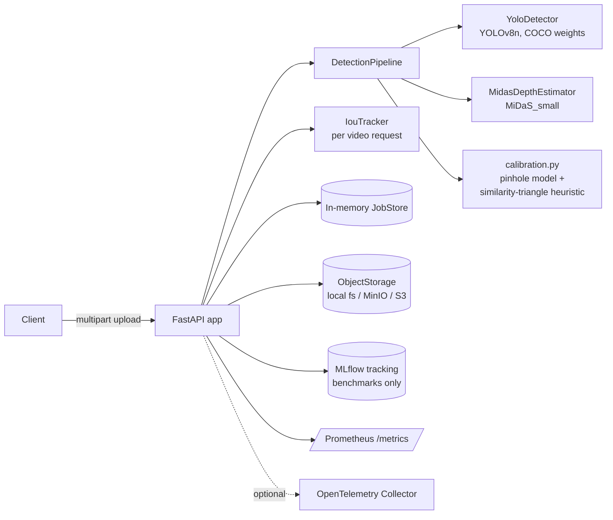

# Architecture

## Overview

The service exposes a single FastAPI process that turns a 2D image or
video into a list of detected objects annotated with an approximate 3D
position. There is no distributed system here by design: this is a
CPU-friendly, single-process inference service intended to run as one or
more stateless replicas behind a load balancer.

## Component diagram

## Request flow: image inference

1. Client `POST`s a multipart file to `/v1/infer/image`.
2. The API validates content-type, size, and decodability, returning
   `415`/`413`/`422` on failure (see `docs/api.md`).
3. `DetectionPipeline.run_on_image`:
   - Runs YOLOv8n on the BGR frame -> 2D boxes, classes, confidences.
   - Runs MiDaS_small on the RGB frame -> a relative depth map (used only
     for potential future frame-level reasoning; not required for the
     per-object metric estimate below).
   - For each detection, `calibration.estimate_metric_depth_m` converts
     bounding-box height + a per-class typical real-world height into an
     approximate depth in meters, and `calibration.pixel_to_3d` back-projects
     the box center through the pinhole camera model into `(x_m, y_m, z_m)`.
4. The response is returned synchronously with per-object depth, 3D
   position, and total latency.

## Request flow: video inference

Video is asynchronous because a 30-second clip can take longer than a
typical HTTP timeout on CPU:

1. `POST /v1/infer/video` validates the upload, writes it to a temp file,
   creates a `Job` in the in-memory `JobStore`, and schedules
   `_process_video_job` as a FastAPI `BackgroundTask`. Returns `202` with a
   `job_id`.
2. The background task opens the video with OpenCV, enforces
   `MAX_VIDEO_DURATION_S`, runs the same per-frame detect+depth+localize
   pipeline as the image path, and additionally passes detections through
   a fresh `IouTracker` instance so `track_id` is stable across frames
   within that one video.
3. The client polls `GET /v1/jobs/{job_id}` until `status` is `completed`
   or `failed`.

## Why an in-memory job store

A single-process, in-memory `JobStore` (`src/threed_od/jobs.py`) is enough
for the local/demo deployment target of this project and keeps the stack
free of a queue dependency. It does **not** survive a process restart and
does **not** work across multiple replicas. If this service needed to
scale horizontally, `JobStore` would be replaced by a Redis- or
database-backed implementation behind the same interface — the rest of
the pipeline code would not change.

## Deployment topologies

- **Local / CPU (default):** `docker compose up` — API + MinIO + MLflow.
  See `docs/local-development.md`.
- **GPU / EC2:** same image built from a CUDA base, `YOLO_DEVICE=cuda`,
  `DEPTH_DEVICE=cuda`. See `docs/deployment.md`.
- **Kubernetes:** manifests under `k8s/` deploy the same container image
  with liveness/readiness probes wired to `/health` and `/ready`.

See `docs/architecture/` for the C4-style component and deployment views,
and `docs/data-model.md` for the request/response schemas.
