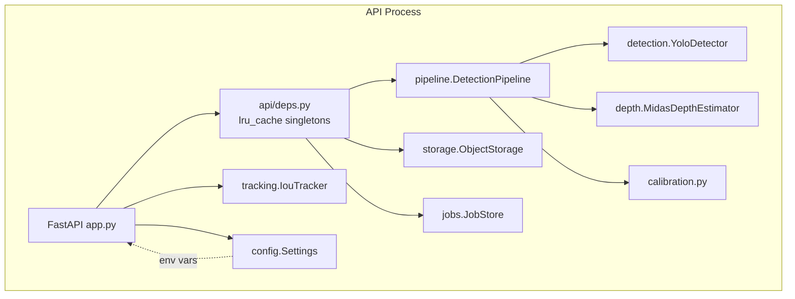

# Component View

Each box under "API Process" is a Python module with a narrow interface
(`Detector`, `DepthEstimator`, `ObjectStorage` are `typing.Protocol`s), so
production adapters (S3 vs. local filesystem) and test doubles (fake
detector/depth estimator) are interchangeable without touching
`pipeline.py` or `app.py`. See `tests/conftest.py` for the fakes and
`tests/contract/test_api.py` for how they're wired into the FastAPI app
via `dependency_overrides`.
