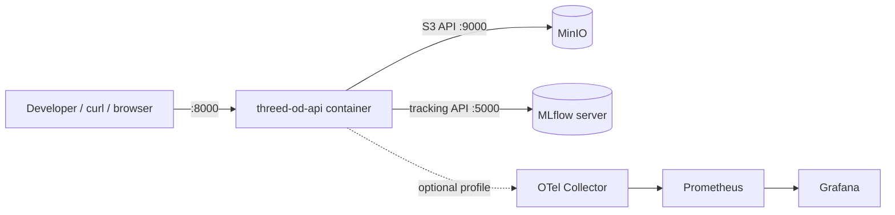
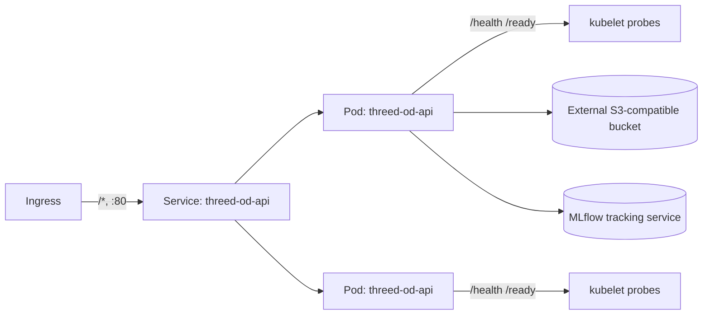

# Deployment View

## Local (Docker Compose)

Started with `docker compose up --build` (core stack) or
`docker compose --profile observability up --build` (adds tracing/metrics
dashboards). See `docs/local-development.md`.

## Kubernetes (reference)

Manifests are in `k8s/` and were authored against `kind`/`k3d` for local
validation (`kubectl apply --dry-run=client` and `kubectl apply -f k8s/`
against a local cluster); see `docs/deployment.md` for exact commands and
`docs/account-activation-checklist.md` for the EKS/AKS-specific overlay
inputs (image registry, IAM role, ingress class) that are account-only.

Because the job store is in-memory and per-pod, `replicas > 1` means a
video-inference job's status is only visible from the pod that accepted
it. `docs/architecture.md` documents the Redis/DB-backed `JobStore`
replacement needed before running multiple replicas behind a
round-robin Service in production.
