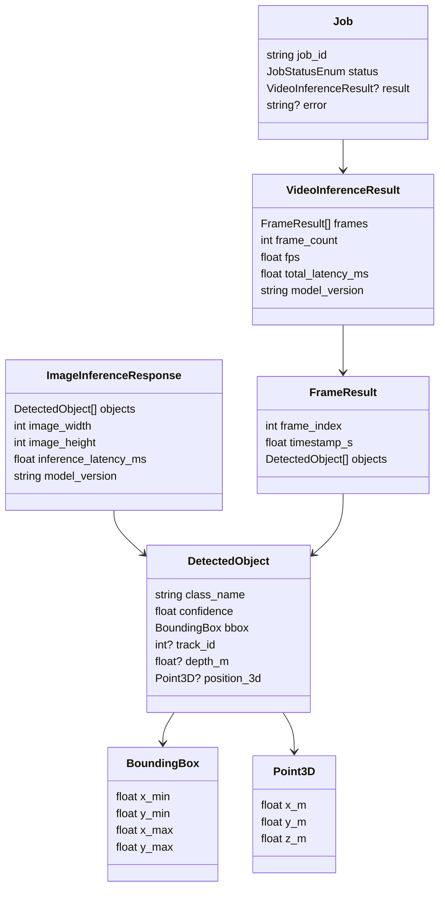

# Data Model

This service is stateless with respect to durable structured data -- there
is no relational database. The "data model" here is the set of typed
contracts in `src/threed_od/schemas.py`, shared by the pipeline and the API.

## Core types

## Where each piece of state lives

| State | Location | Lifetime |
|---|---|---|
| Uploaded image bytes | In-process memory only | Duration of one request |
| Uploaded video bytes | Temp file on local disk (`tempfile.NamedTemporaryFile`) | Deleted in a `finally` block after processing, success or failure |
| Video job status/result | `JobStore` (in-memory dict, `src/threed_od/jobs.py`) | Until `JOB_RESULT_TTL_S` expires or process restarts |
| Model weights | Local filesystem cache (`yolov8n.pt` in the working dir; `~/.cache/torch/hub` for MiDaS) | Persists across restarts once downloaded |
| Benchmark results | `docs/benchmarks/latency_results.json` (committed) + MLflow run store (`mlruns/`, gitignored) | Committed JSON is a point-in-time snapshot; MLflow retains full run history locally |
| Artifacts a caller explicitly stores | `ObjectStorage` (local filesystem or S3/MinIO, per `STORAGE_BACKEND`) | Caller-managed; this project provides the adapter, not a retention policy, since no endpoint currently writes to it automatically |

## Why no database

The service has no need for relational storage: every request is
independent, and the only stateful concept (an async video job) is
short-lived by design. If a future requirement needed durable job history
across restarts or multiple replicas, `JobStore`'s interface
(`create`/`get`/`mark_processing`/`mark_completed`/`mark_failed`) would be
implemented against Redis or a small SQL table without changing any
calling code (see `docs/architecture.md`).
