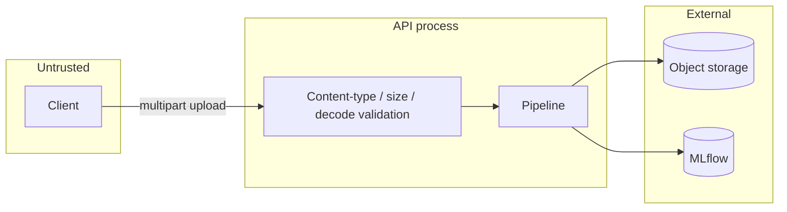

# Threat Model

## Assets

- **Uploaded images/video**: transient, processed in memory or a short-lived
  temp file, deleted after processing (video). Never persisted to disk for
  images; never written to durable storage unless the caller separately
  uploads to `ObjectStorage`.
- **Model weights**: public, pretrained, non-sensitive. No proprietary
  training data or fine-tuned weights exist in this project.
- **Object storage credentials / MLflow URI / OTLP endpoint**: read from
  environment variables only; see `docs/environment-variables.md`.

## Trust boundaries

Every byte from `Client` is untrusted until it passes content-type
allowlisting, a bounded-size read, and successful image/video decoding.

## Threats and mitigations

| Threat | Mitigation |
|---|---|
| Oversized upload exhausting memory/disk (DoS) | `_read_upload_within_limit` reads at most `MAX_UPLOAD_SIZE_MB + 1` bytes and rejects with `413` before ever holding the full payload if it's over budget. |
| Malformed/malicious file bytes crashing the decoder | `cv2.imdecode` / `cv2.VideoCapture` failures are caught and converted to `422`/job-failure, never an unhandled 500 or process crash. |
| MIME-type spoofing (e.g., an executable renamed to `.jpg`) | Content-type allowlist is a first filter, but the authoritative check is that `cv2.imdecode`/`VideoCapture` must successfully decode real image/video data; non-image/video bytes fail decode regardless of the claimed content-type. |
| Path traversal via uploaded filename | The video upload path derives only the file *extension* from the client-supplied filename (`os.path.splitext`) and writes to a `tempfile.NamedTemporaryFile`-generated path -- the client-supplied name is never used directly as a path. |
| Long-running video jobs starving the process | `MAX_VIDEO_DURATION_S` bounds per-job CPU cost; jobs run via FastAPI `BackgroundTasks` in-process (see Known limitations below for the scaling implication). |
| Dependency vulnerabilities | `pip-audit` runs in CI (`security` job) against the resolved dependency set. |
| Committed secrets | `.env` is gitignored; `.env.example` contains only placeholder/local-default values; `gitleaks` runs in CI. |
| SSRF / arbitrary network access from user input | No user-supplied URL is ever fetched by the server; only uploaded file bytes are processed. |

## Dependency audit status

`pip-audit --skip-editable` (run 2026-08-27, see
`SHRIYA_PORTFOLIO_BUILD_STATUS.md` in the parent workspace for the full
before/after): after upgrading dependencies to current stable releases,
**32 advisories remain, all in 3 packages, all with a documented reason
they were not force-upgraded this session**:

- **`mlflow` (29 advisories):** every fix requires the 3.x major line
  (mlflow 2.x cannot be patched further). Not migrated this session --
  it's a breaking major-version change and mlflow here is a local,
  file-backed dev/benchmark tool (`scripts/evaluate_latency.py` and the
  optional Compose `mlflow` service), never on the API's live
  request-serving path, and never fed untrusted network input.
- **`pyarrow` (1 advisory):** pulled in transitively by `mlflow`, which
  pins `pyarrow<20`; fixed only at pyarrow 23+. Resolves automatically
  once `mlflow` is migrated to 3.x.
- **`pytest` (1 advisory):** fixed in pytest 9.0.3, a major-version bump
  from the 8.x line used here. Not adopted this session to avoid an
  untested plugin-compatibility migration this late in the release cycle.
  `pytest` is a dev-only dependency and is never installed in the
  production container image (`Dockerfile` only installs the base,
  non-`[dev]` extra).
- **`setuptools` (4 advisories, all in the base venv, not a declared
  project dependency):** stale copy bundled by the Python installation
  itself; not imported by any runtime code path.

All other previously-flagged packages (`fastapi`, `starlette` transitively,
`uvicorn`, `pydantic`/`pydantic-settings`, `python-multipart`, `torch`,
`torchvision`, `ultralytics`, `timm`, `boto3`, `opencv-python-headless`,
`prometheus-client`, `opentelemetry-*`, `structlog`, `pillow`, `ruff`,
`mypy`) were upgraded to current stable releases and are clean.

## Known limitations (not yet hardened -- documented per this project's truthfulness policy)

- **No authentication or authorization** is implemented on any endpoint.
  This service is designed to run behind a trusted network boundary (e.g.,
  an internal load balancer or an API gateway that adds auth) for a real
  deployment, or purely as a local/demo service. Do not expose it directly
  to the public internet without adding an auth layer.
- **No per-client rate limiting.** A single client can submit unlimited
  requests; add a reverse-proxy or gateway-level rate limit before public
  exposure.
- **In-memory job store is unauthenticated and global**: any caller who
  learns a `job_id` (e.g., by guessing a UUID, which is
  cryptographically infeasible, but there's also no ownership check) can
  read that job's result. For multi-tenant use, add per-job ownership
  tokens.
- **No output content moderation**: this service does not screen uploaded
  images for illegal/harmful content; deploy behind existing platform
  moderation if accepting untrusted public uploads.

## Reporting

See `SECURITY.md` at the repository root for the vulnerability reporting
contact.
